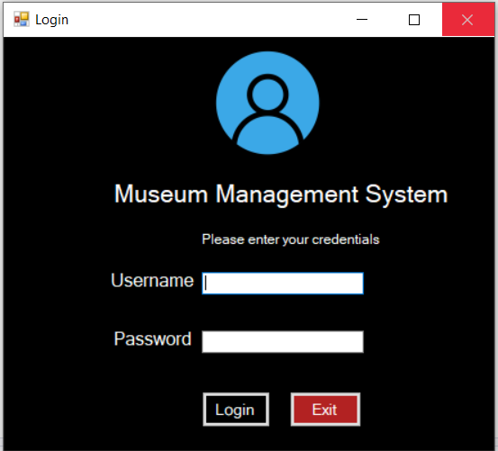
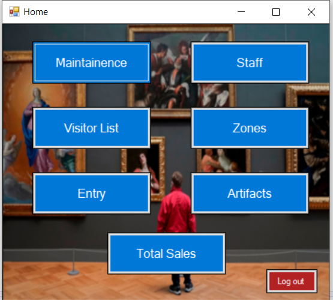
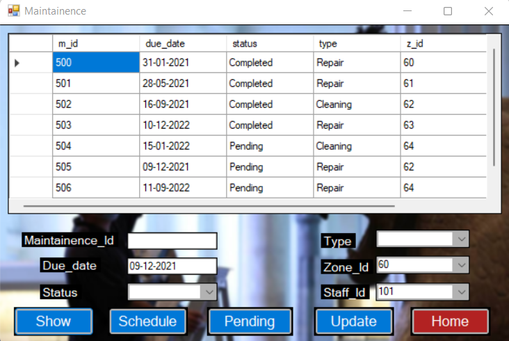
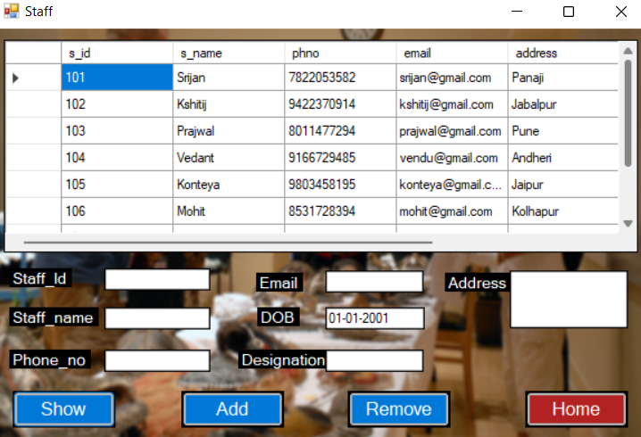
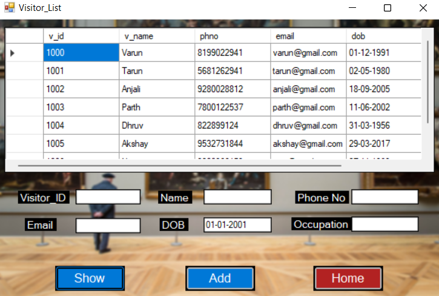
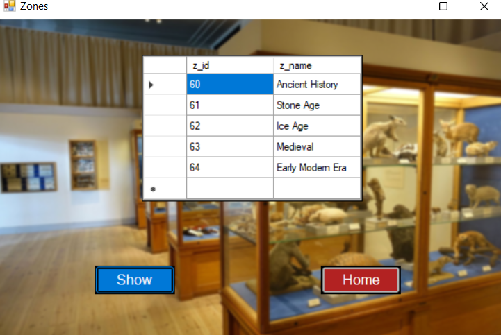
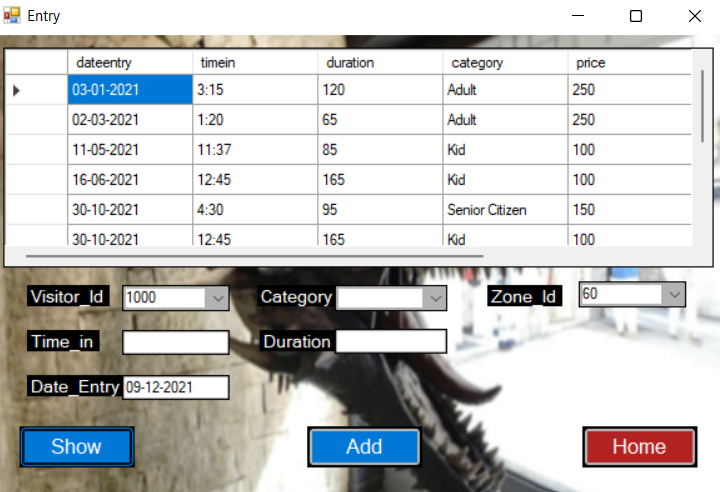
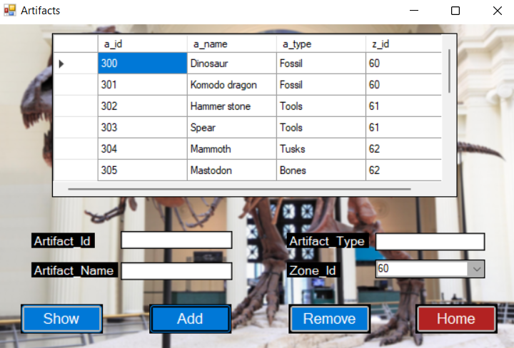

# Museum_Management_System

A Database Management System for Museum for Easier maintenance.
The Project is built using C#(Visual Studio) for Frontend and MySql for Backend.
 

<table style="border:1px solid;">
  <tr >
    <th style="text-align: center; border:1px solid;">Login Page</th>
    <th style="text-align: center; border:1px solid;">Home Page</th>
    <th style="text-align: center; border:1px solid;">Maintainence Page</th>
  </tr>
  <tr >
    <td style="text-align: center; border:1px solid;padding:1em;">
        
    </td>
    <td style="text-align: center; border:1px solid;padding:1em;">
         
    </td>
    <td style="text-align: center; border:1px solid;padding:1em;">
         
    </td>
  </tr>
  
</table>
 
<table style="border:1px solid;">
  <tr >
    <th style="text-align: center; border:1px solid;">Staff Page</th>
    <th style="text-align: center; border:1px solid;">Visitor List</th>
    <th style="text-align: center; border:1px solid;">Zones</th>
  </tr>
  <tr >
    <td style="text-align: center; border:1px solid;padding:1em;">
        
    </td>
    <td style="text-align: center; border:1px solid;padding:1em;">
         
    </td>
    <td style="text-align: center; border:1px solid;padding:1em;">
         
    </td>
  </tr>
  
</table>
 
<table style="border:1px solid;">
  <tr >
    <th style="text-align: center; border:1px solid;">Entry </th>
    <th style="text-align: center; border:1px solid;">Artifacts</th>
    <th style="text-align: center; border:1px solid;">Total Sales</th>
  </tr>
  <tr >
    <td style="text-align: center; border:1px solid;padding:1em;">
        
    </td>
    <td style="text-align: center; border:1px solid;padding:1em;">
         
    </td>
    <td style="text-align: center; border:1px solid;padding:1em;">
         
    </td>
  </tr>
  
</table>
 

<table style="border:1px solid;">
  <tr >
   
  </tr>
  
</table>

ER Diagram

 
Schema Diagram

